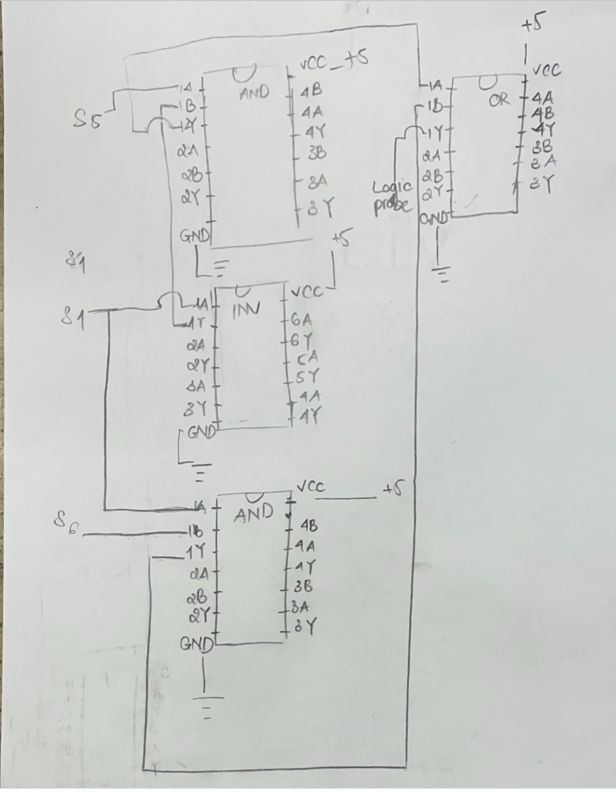
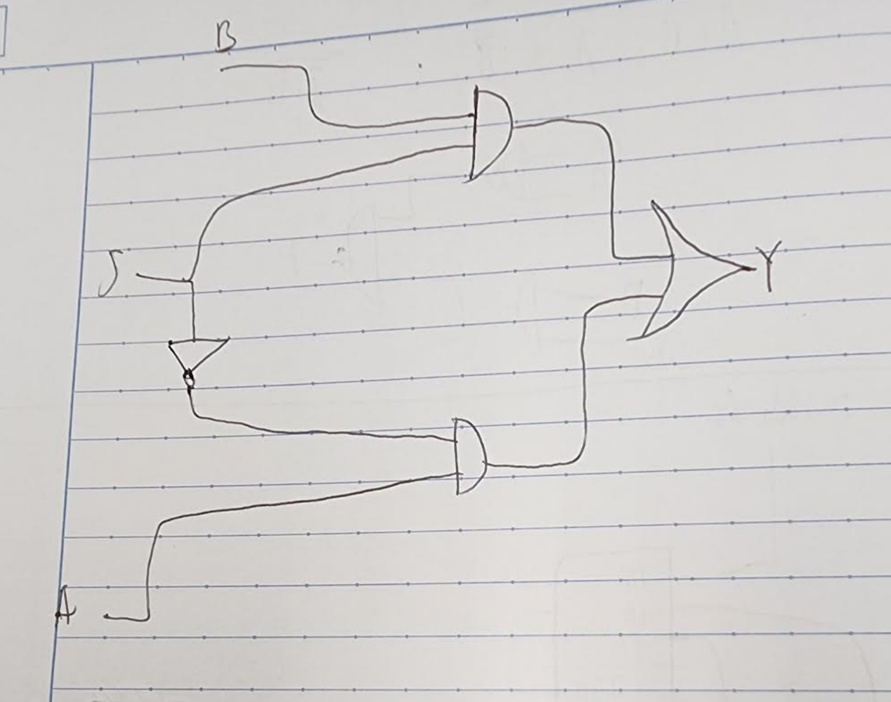
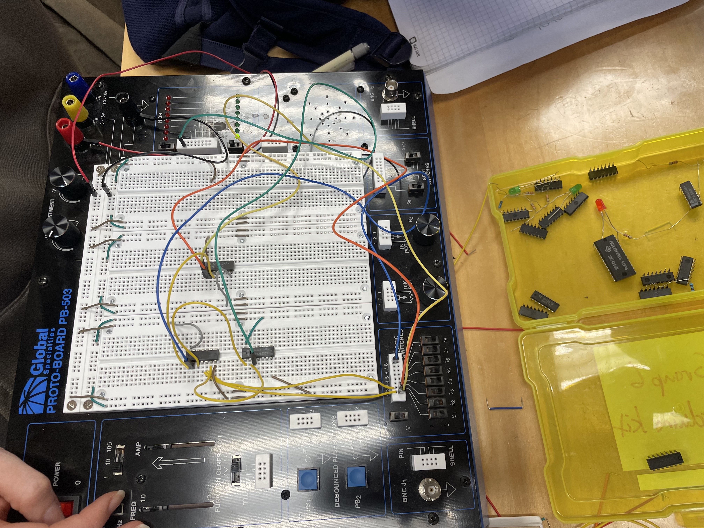
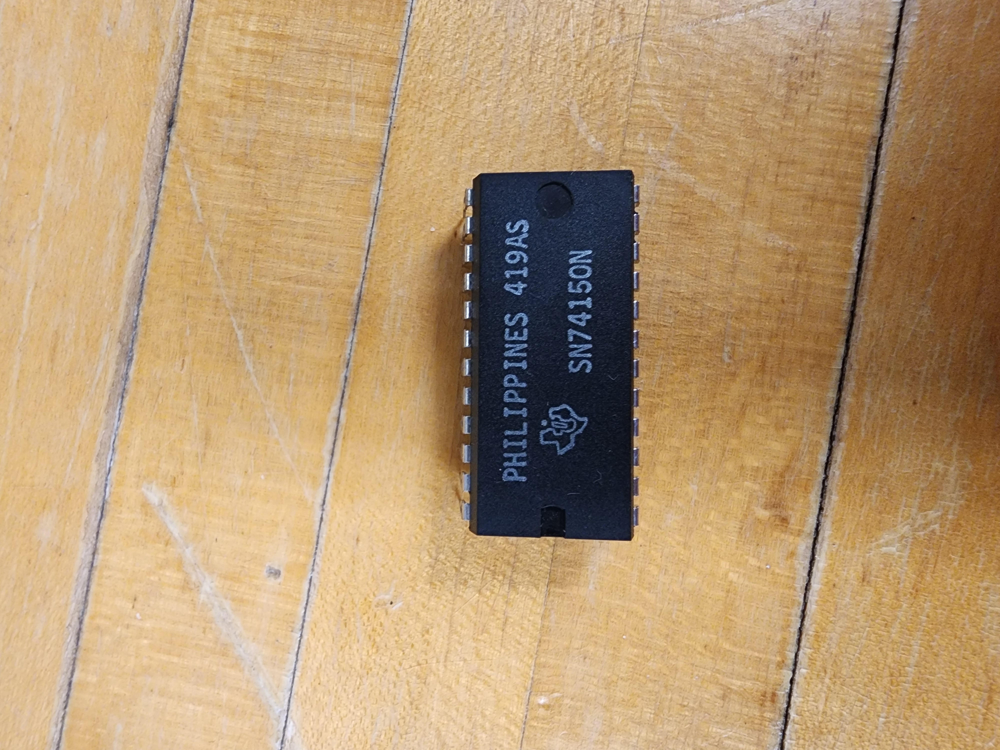
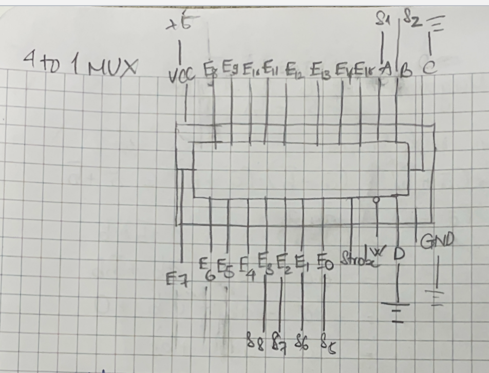
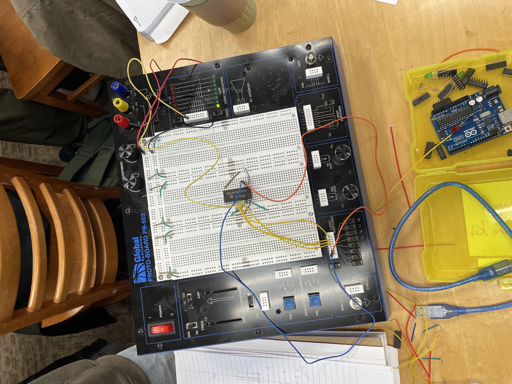
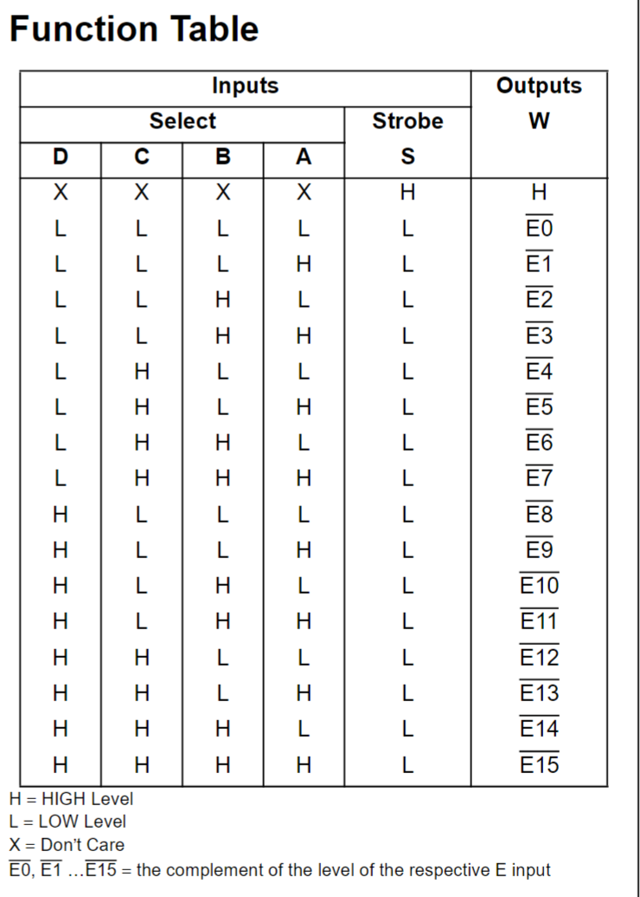
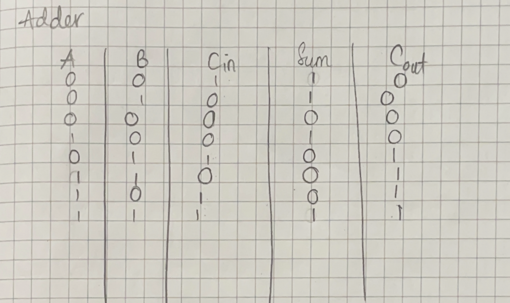
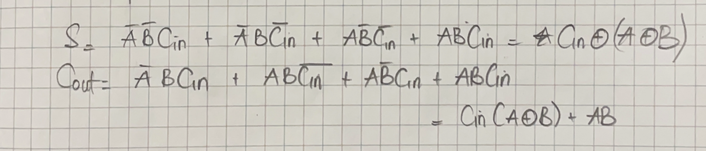

# Lab 2: Adders and Multiplexers

## Overview and Motivation - Utsav
This week we'll explore Digital Design, in terms of learning about the two important circuit components, a Multiplexer and an Adder Circuit. This lab will get us more familiarity with working on breadboards - PB-503 prototyping stations, Arduino - a microcontroller system for embedded processor control, logic gates and circuits in general. Our main goal was to build on the introductory circuits we learned last week and design two more important circuits, Mux Circuit and Adder Circuit.


To successfully learn and complete the lab, we divided the lab in four parts. They are:

  - Building a 2 to 1 mux out of AND, OR and NOT gates, tested with switches.
  - Building a 4 to 1 mux using a 74150 mux chip, tested with switches.
  - Building a 4 to 1 mux using a 74150 mux chip, tested with Arduino program.
  - Designing and building a 1 bit adder circuit.


## 2 to 1 Multiplexer - Long
### Objective
In this first part of the lab, we will simulate a 2 to 1 multiplexer using only AND, OR and NOT gates. The aim here is to demonstrate that any multiplexer can be taken apart into basic Boolean logic. By using just AND, OR, and NOT gates, we can create all kinds of multiplexers, like 2 to 1 or 16 to 1.
### Materials
The materials required for this part are: one circuit diagram, one wiring diagram, a PB-503 breadboard, as well as 3 IC chips: 7404 (NOT), 7408 (AND), and 7432 (OR). 

<center></center>

<center>2 to 1 wiring diagram</center>

<center></center>

<center>2 to 1 circuit diagram</center>


### Steps 

    Step 1: We wire the 5 volts source to the top row of the breadboard, as well as the ground to the row right below. This setup will be kept throughout the lab.

    Step 2: We plug two 7408(AND) chips, one 7404(NOT) chips, and one 7432(OR) chips into the breadboard. We connect the IC chips' VCC pins into the 5 volts source and GND pins into the ground.

    Step 3: The S1 switch is going to be our select line for the multiplexer, with the S5 switch representing input line A and the S6 switch representing input line B. We connect S1 and S6 to an AND gate's input pins (1A and 1B). 

    Step 4: We also connect S1 to an inverter (NOT gate), through which the signal from S1 will be inverted and directed to the other AND gate's input pin. This AND gate also takes signal from S5.

    Step 5: The output from our two AND gates will be connected to our OR gate, whose input is wired to the logic probe (the red and green indicator light on our breadboard).

Our breadboard would look like this:
 
<center></center>

<center>2 to 1 circuit</center>

### Testing 
Testing this circuit board is simple. From the wiring diagram, we see that depending on the signal from S1, the output to the OR gate would come from either the top or bottom AND gate. If S1 sends a 1, then the output will be dependent on the S6 switch. Otherwise, if S1 sends a 0, the signal goes through the inverter, where it is turned to 1, activating the top AND gate. The output will now depend on S5. This testing procedure can be shown in the video below.

(2to1TestingVid)


## 4 to 1 Multiplexer - Long
### Objective

The goal of this section is to get us familiarity with the 74150 chip, a 16 to 1 multiplexer. We will only build a 4 to 1 multiplexer using this chip, which means only 4 out of the 16 data lines and 2 out of the 4 input lines will be used.

### Materials
We will need a 74150 16 to 1 multiplexer chip, its documentation with the function table for configuring data selects, a wiring diagram, and the PB-503 breadboard.

<center></center>

<center>74150 16 to 1 multiplexer</center>

### Steps 
We will do the wirings based on the wiring diagram below.


<center></center>

<center>4 to 1 multiplexer diagram</center>

    Step 1: We plug in the multiplexer chip into the breadboard, connecting it to the 5 volts power source and ground using its VCC and GND pins, respectively.

    Step 2: The strobe - the bottom 4th pin from the right - must always be connected to the ground, otherwise the multiplexer will not output anything. The output pin on the right of the strobe is wired to our logic probe.

    Step 3: We connect the chip's select lines A and B (top 3rd and 2nd pins from the right) to switch S1 and S2. Select lines C and D will always be wired to the ground, since the data lines we are using all require C's and D's signal to be 0. The chip's data lines E0 (left of the strobe), E1, E2, and E3 are connected to switch S5, S6, S7, S8.

After these steps, our breadboard will look like this: 

<center></center>

<center>4 to 1 multiplexer</center>


### Testing

To test that the multiplexer works as expected, we rely on its function table. If the combination of select lines allow the desired inputs line to work, then the multiplexer is behaving correctly. Looking at the function table, E0, E1, E2, and E3 all require C and D to be 0, which is why we connect them to the ground instead of a switch. We test the following: 

    - when A and B are low, input line E0 works.
    - when A is high and B is low, input line E1 works.
    - when A is low and B is high, input line E2 works.
    - when A and B are high, input line E3 works.


<center></center>

<center>74150 Function Table</center>

Interestingly, the multiplexer invert every output. Our testing is demonstrated in the video below.

(4to1TestingVid)

As expected, the combination of A's and B's low signals made the output dependent on E0, which is toggled by the S5 switch. Since the multiplexer inverts every output, E0's low signal results in red (1) in the logic probe, and vice versa.

## 4 to 1 Multiplexer with Arduino - Vuong
### Objective
The goal of this section is to learn to use Arduino to operate the MUX. In this section we will use the 4-to-1 MUX built from the previous section. 

### Materials 
The main materials for this section is a 4-to-1 MUX and an Arduino. Also, we will still need the circuits: wires and breadboard. 

### Steps 
Overall, in this section we will connect the 4-to-1 MUX with the Arduino to test its operation using our program. 

##### 1. Circuit:
We first start off building our circuit. To build the circuit we follow wire the MUX with the Arduino according to the instructions:
- Wire pin 10 with Data input A (E0 on the mux) 
- Wire pin 11 Data input B (E1 on the mux) 
- Wire pin 12 Data input C (E2 on the mux) 
- Wire pin 13 Data input D (E3 on the mux)
- Wire pin 8 Select Line 0 (A on the mux) #check which switch this is
- Wire pin 9 Select Line 1 (B on the mux)
- Wire pin 7 output data from mux (w on the mux)
- Lastly, Connect the GND (adjacent to pin 13, on the data side, not the power side) to ground on the breadboard. **It is important to make sure that both the Arduino and the breadboard share the a common sense of "ground"**

You might wonder but we don't need to wire the Arduino with +5V (High) power source since the power is provided through our laptop. However, since we cannot provide the Ground, we still must wire Ground to the 0V hole. 

<center></center>

Now, we will need to write a program for the Arduino. For this lab, we will use the following program:

<center></center>

*Tips: You can have one person write the program while the other two wiring the circuits.*

``` 
const int S0[] = {0,0,1,1,0,0,1,1}; 
const int S1[] = {0,0,0,0,1,1,1,1};
const int A[] = {0,1,0,0,0,0,0,0};
const int B[] = {0,0,0,1,0,0,0,0};
const int C[] = {0,0,0,0,0,1,0,0};
const int D[] = {0,0,0,0,0,0,0,1};
const int Y[] = {0,1,0,1,0,1,0,1};

// You are probably using a 74150, so the outputs are reversed.
// Use this Y instead:
// const int Y[] = {1,0,1,0,1,0,1,0};

const int WAIT0 = 300;
const int WAIT1 = 2000;
int index = 0;
int x;  // for reading input
void setup() {
  // Serial Port setup for communication back to computer
  Serial.begin(9600);
  // data pins are outputs (for Arduino)
  pinMode(10,OUTPUT); // A
  pinMode(11,OUTPUT); // B
  pinMode(12,OUTPUT); // C
  pinMode(13,OUTPUT); // D

  // select pins are outputs (for Arduino)
  pinMode(8,OUTPUT);  // S0

pinMode(9,OUTPUT);  // S1

  // Mux output is input for Arduino
  pinMode(7,INPUT);
}

void loop() {
  // write data inputs to MUX
  digitalWrite(10,A[index]);
  digitalWrite(11,B[index]);
  digitalWrite(12,C[index]);
  digitalWrite(13,D[index]);

  // write select line inputs to MUX
  digitalWrite(8,S0[index]);
  digitalWrite(9,S1[index]);

  delay(WAIT0);   // give time for logic signal to propagate

  // read the MUX output
  x = digitalRead(7);

  // display the results
  Serial.print(index);
  Serial.print(" x:");
  Serial.print(x,BIN);
  Serial.print(", y:");
  Serial.print(Y[index],BIN);
  Serial.print("\t ");
  if ( x == Y[index] )
  {
    Serial.print(": OK\n");
  }
else {
    Serial.print(": BAD\n");
  }
  delay(WAIT1);
  index = (index+1) % 8;  // increment index
}
```
Now as we finish writing the program, go ahead and open the "Serial Monitor" window in the Arduino IDE. It is the magnifying-glass like icon in th eupper right corner of the IDE. You should see the resulats of your tests scroll across this window. 

### Testing 
Now you will see the program print out some "BAD" and some "OK" lines. Get why? The constant array passed in ```Y[] = {0,1,0,1,0,1,0,1}``` is the output of the MUX. while ``` S0, S1, A, B, C, D``` are the 2 selectors and 4 inputs, respectively. Now you see why some ouputs are "BAD"? Yes. Some outputs in our ```Y``` are not the correct outputs according to the corresponding selectors' inputs. Hence, in order for the program to print out all "OK", we will need to change our outputs ```Y```. Look up in the pin-outs of 4-to-1 MUX and re-write the correct outputs for ```Y```. For example, if the input of S0 = 0 and S1 = 0, we will choose input E0 which is A in this case. The result is not E0 (as in the pin-outs). Since the first entry of ```A``` array is 0, not 0 is 1. Then, 1 is the first entry in the output array ```Y```. Now trace the entire arrays and correct the outputs. Your program should print out all ```OK```.  

[Your program should print out all OK](https://drive.google.com/file/d/1y4oNfLzBKID9yHvfWuYEQPd1LxKLbYpR/view)

## Adder Circuit - Vuong
Now we move on and build an adder circuit. As we already learned about adding rule in class, 0 and 0 results in sum 0 and carry-out 0. 1 plus 1 will give a sum of 0 with carry-out 1. Now, we will apply those adding rules into building a circuit.

### Objective
The goal of this section is for you to understand how to apply adding logic into building a circuit. 

### Materials
Similar to other parts of the lab, we will need breadboard, wires for this section of the lab. We also need 2 XOR gates for this circuit design.

### Steps
Before starting building a real circuit, you should first draw the circuits on paper. First, we will draw the truth table that has 2 inputs, a carry-in, a sum S, and a carry-out column. 

<center></center>

Once we have the truth table, we will have to construct the SOP (sum-of-products) boolean expression for our circuit. We construct the sum by adding lines (use + logic operation) that result in 1 in our inputs. Since we have 2 outputs: sum S and carry-out, we will construct 2 SOP sum. 

<center></center>

##### Wire Sum S circuit:
Now, we will wire the circuit following the expression. 
First, let's start building the circuit for the sum S. Following the expression, we need 2 XOR **7486 gates**.
- Wire 2 swithces S1 and S2 to the 2 inputs pins on the gates.
- Wire the output (at output pin Y) to the second XOR gate as input 1.
- Wire S8 (you can choose any other switch holes on the SWITCH panel except for the 2 inputs we just have chosen) to the second input pin of the second XOR gate. 
- Wire the output of the second XOR gate to the logic probe. 
- Wire Vcc and GND of the 2 gates to the +5V and Ground holes on the breadboard, respectively. 

<center></center>

##### Wire  Carry-out circuit:

We move on to build the carry-out circuit. Similarly, we will follow the boolean expression. We will need 1 AND gate (7400 gate), 1 7486 XOR gate, and 1 7432 OR gate.
- Wire 2 switches S1, S2 to the 7486 XOR gate. Wire the output of this gate to the 7400 AND gate. 
- Wire the switch S8 (or any other switch except the two we just wired) to as the second input of the 7400 AND gate.
- Wire the output of the 7400 AND gate as one input of the 7432 OR gate.
- Now, this step will be a little confusing. Take 2 other wires, plug the first wire into one of the hole on the row where the S1 wired to on SWICTH panel. Do the same thing for the seciond wire but plug it onto the row where the S2 is plugged (still on SWITCH panel). Wire the other ends of the 2 wires as 2 inputs for the second input-output pins on the AND 7400 gate (as we re-use 1 AND gate for 2 pairs of inputs-outputs). 
- Wire the output of the second input-output pair that we have just wired in the previous step as second input of the 7432 OR gate. 
- Now, wire the output of the 7432 OR gate to the logic probe.

<center></center>

### Testing
##### Testing sum S circuit:
Now that we finished wiring the sum S circuit, it should works as our truth table. For example, when we turned both S1, S2, and S8 off (A=0, B=0, Cin=0), the LED should light up green meaning the power is at LOW.

Similarly, for the carry-out circuit, the LED should work exactly as the logic in our truth table. For instance, when we set S1=0, S2=0 and S8=1, the LED should light up Green indicating the power passes through it is at 0V. 

[Carry out circuit](https://drive.google.com/file/d/1qxZnN8-faqeWTYPcR6fj9g88IjqDI19f/view)

## Conclusion - Utsav


In Conclusion, this lab provided a hands-on experience in designing, building, and testing digital circuits, specifically focusing on Multiplexers and Adder circuits. The lab was divided in four parts, each targeting different aspects of digital design. 

- 2 to 1 Mux

  In the first part, we constructed a 2 to 1 mux using AND, OR, and NOT gates. As we learned in class, these are universal gates i.e. every logic gate can be formed using these three basic gates. This part helped us to understand the fundamental principles of mux and how various/universal logic gates can be combined and used to achieve a specific function. The testing phase of this part showed the proper operation of the 2 to 1 mux with manual switches. 

- 4 to 1 Mux

  The second part introduced us to 74150 chip which is a 16 to 1 mux chip. For the purpose of this lab, we focused on building a 4 to 1 mux using this 16-1 mux chip. The hands-on experience helped us understand that it is possible to use a bigger input mux (16-1) even if we are only using some parts of it and not using all the inputs (4-1) mux. This means one can use a 32-1 mux chip as a 16-1 mux and make it function like a 16-1 mux with proper function table and by referring to the chip's documentation. We also learned that there was an unexpected inversion of outputs meaning the output was inverted (NOT).

- 4 to 1 Mux with Arduino

  This part helped us learn that we can control the inputs of our 4-1 Mux using Arduino. We developed a program in C that could control the all the inputs and read the output of our Mux. We compared the expected outputs with the program's output to make sure our Mux was functioning as intended.

- 1-bit Adder Circuit

  The final part of this lab was to design and implement a 1-bit adder circuit. To do this, we followed the truth table and SOP expressions to construct the circuit using XOR, AND, and OR gates. We tested this out using the manual switches.


## Conclusion - Utsav

Overall, This lab expanded our understanding of digital circuits, Boolean Logic, and the practical applications of Mux and Adders. Working with both, manual switches and the automated control using arduino for controlling the inputs helped us understand and appreciate the efficiency and versatility that Arduino brings in to the world of Digital circuit design. Not just this, the challenges faced during the lab, such as unexpected outputs, inversion of outputs, etc helped us gain valuable troubleshooting experience and enhanced our problem-solving skills.


